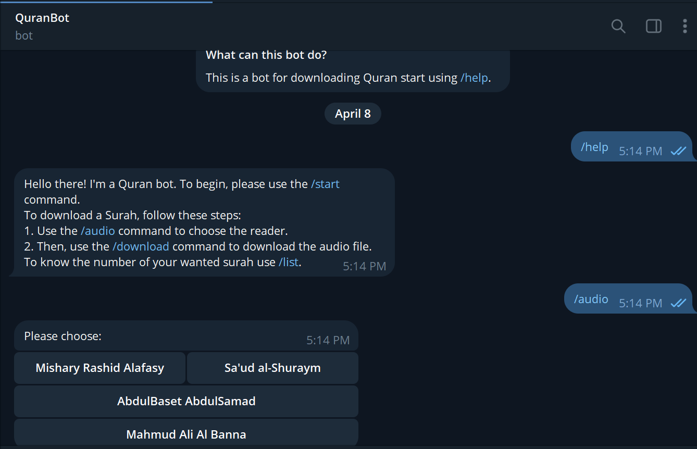

Sure, here's the README.md file updated based on the provided format:

# Quran Bot

The Quran Bot is your companion for accessing and downloading audio files of Quranic verses directly from Telegram. It helps you select from various renowned reciters, download specific Surahs by specifying the Surah number, and explore the list of available Surahs with their names and numbers.

## Features

- Choose from multiple reciters for your preferred audio experience.
- Download specific Surahs by specifying the Surah number.
- Explore the list of available Surahs with their names and numbers.

## Example

Here's an example of how the bot works:




## Installation

To start using the Quran Bot, follow these simple steps:

1. **Clone the Repository:**

   ```bash
   git clone https://github.com/your-username/Quran-Bot.git
   ```

2. **Install Dependencies:**

   Navigate to the cloned repository directory and install the required dependencies:

   ```bash
   cd Quran-Bot
   pip install -r requirements.txt
   ```

3. **Set Up Your Telegram Bot Token:**

   Replace `TOKEN` in the code with your actual Telegram bot token. Don't forget to change the paths to the right folders.

## Usage

1. **Run the Bot:**

   Start the bot by running the Python script:

   ```bash
   python bot.py
   ```

2. **Interact with the Bot:**

   Start a chat with the Quran Bot on Telegram and use the following commands:
   
   - `/audio`: Choose your preferred reciter.
   - `/download [Surah number]`: Download a specific Surah audio.
   - `/list`: View the list of available Surahs.

3. **Enjoy!**

## Contributing

Contributions are welcome! If you want to contribute to this project, follow these steps:

1. Fork the repository.
2. Create a new branch (`git checkout -b feature/your-feature-name`).
3. Make your changes.
4. Commit your changes (`git commit -am 'Add new feature'`).
5. Push to the branch (`git push origin feature/your-feature-name`).
6. Create a new Pull Request.

## Feedback
``` 

Have ideas or issues? Share them in the [issues section](link to your GitHub repository's issues page). Let's make this bot even better!
